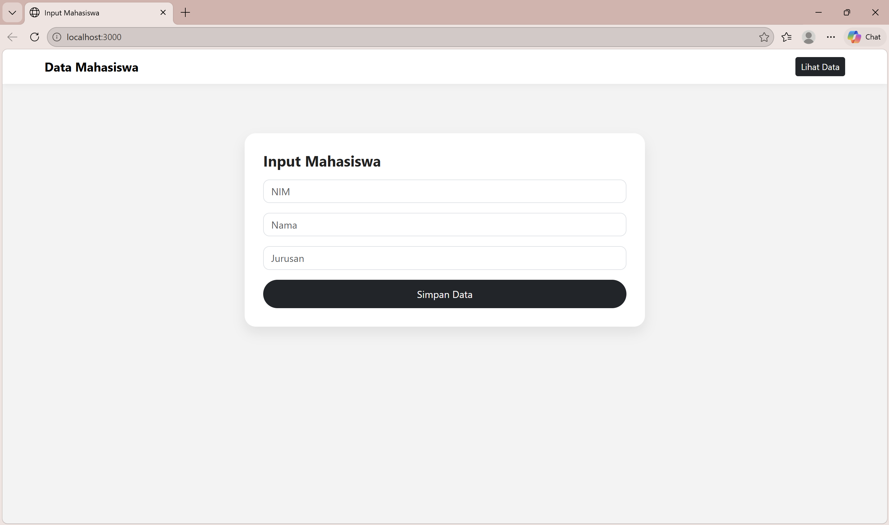
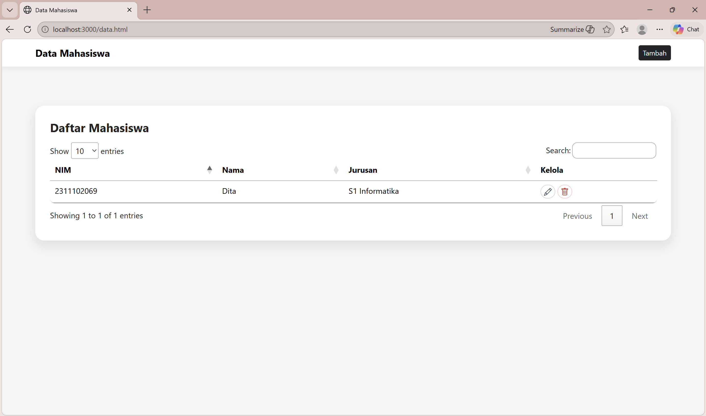
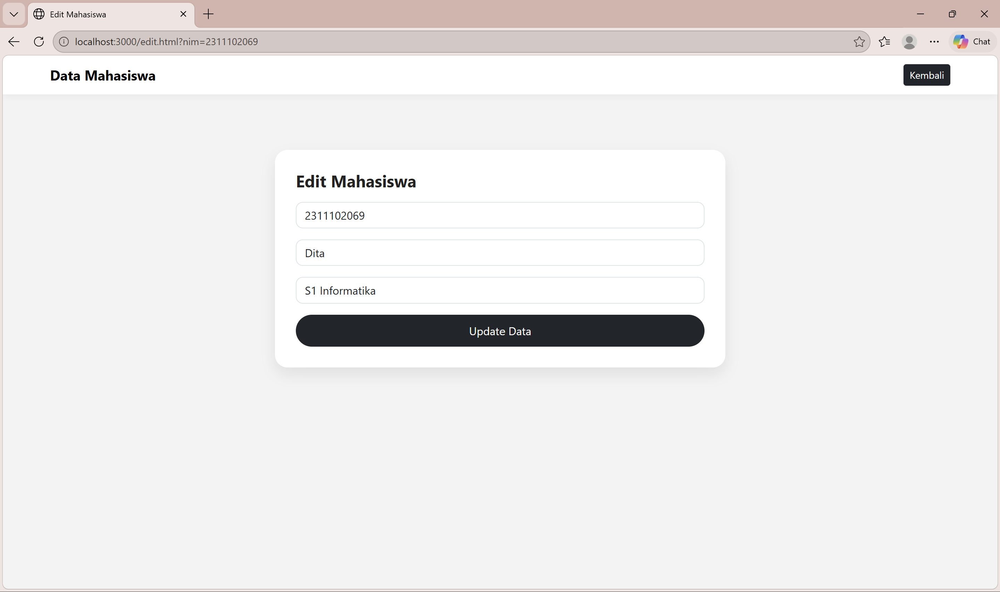

# Student Data Management System

## Deskripsi
Aplikasi web sederhana untuk mengelola data mahasiswa berbasis CRUD (Create, Read, Update, Delete).

## Fitur
- Tambah data mahasiswa
- Tampilkan data dalam tabel
- Edit data
- Hapus data
- Tabel interaktif (search, sorting, pagination)

## Teknologi yang Digunakan
- HTML, CSS, Bootstrap
- JavaScript (jQuery, AJAX)
- DataTables
- NodeJS
- JSON

## Cara Menjalankan Aplikasi
1. Install NodeJS
2. Install dependency:
   npm install
3. Jalankan server:
   node server.js
4. Buka browser:
   http://localhost:3000

## Screenshot

### Halaman Form

### Halaman Data

### Halaman Edit

